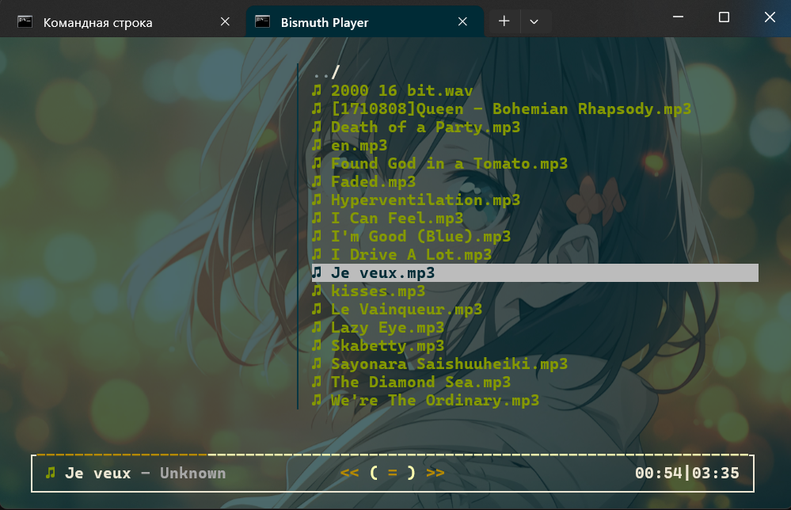
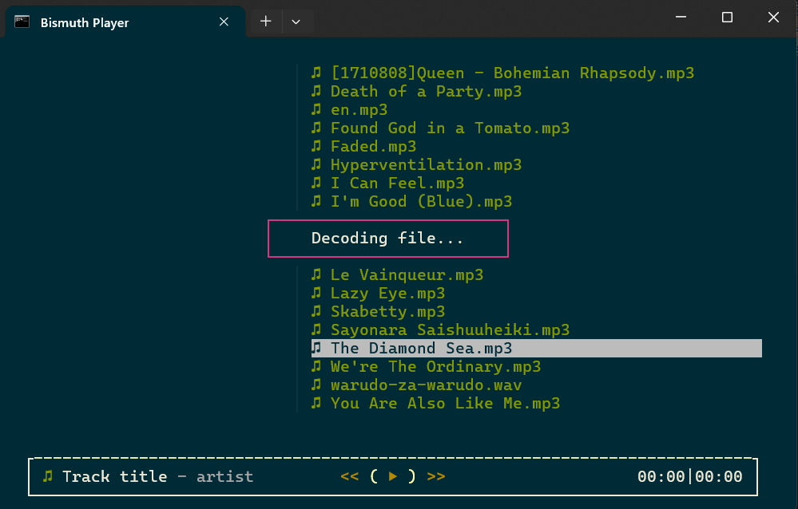

# Bismuth

## Описание

Bismuth - минималистичный (не в плане ресурсов) аудио плейер с терминальным интерфейсом, написанный на Node.js.

Плеер находится в разработке! Многие функцию пока не работают/работают не так, как должны.






## Возможности

- Воспроизведение аудио файлов различных форматов (MP3, OGG, WAV и другие), с помощью ffmpeg
- Воспроизведение аудио производится с помощью node-speaker
- Терминальный интерфейс, построенный на reblessed (fork blessed), с поддержкой мыши
- Возможность самостоятельной настройки интерфейса (конфигурационными файлы в папке ui-options/)
- Просмотр информации об аудио-файле, с помощью music-metadata
- Поддержка Windows, Linux и macOS (я надеюсь)

- В будущем планируется прямое скачивание треков через Yandex Music API (с помощью пользовательского токена)

## Установка

1. Установите Node.js (>= 16)

2. Клонируйте репозиторий:
   ```
   git clone https://github.com/SuperJaba2000/bismuth
   cd bismuth
   ```

3. Установите зависимости:
   ```
   npm install
   ```

## Использование

Запустите приложение командой:
```
npm start
```

## Структура проекта

- `src/index.js` - основной файл приложения
- `src/filemanager.js` - изменённый filemanager из reblessed (для выделения аудио-файлов в списке), требуется замены вручную 
- `src/logger.js` - логирование
- `src/ui.js` - пользовательский интерфейс
- `src/audio/` - модули для работы с аудио
- `src/ui/` - компоненты интерфейса
- `ui-options/` - конфигурационные файлы интерфейса

## Зависимости

- `@descript/web-audio-js` - для работы с веб-аудио
- `audio-decode` - декодирование аудио (сейчас не используется)
- `ffmpeg-static` - статическая сборка FFmpeg
- `fluent-ffmpeg` - обертка для FFmpeg
- `json5` - парсер JSON5 для файлов конфигурации интерфейса
- `music-metadata` - чтение метаданных аудиофайлов
- `reblessed` - терминальный UI (форк blessed)
- `speaker` - вывод аудио через Speaker
- `winston` - логирование

## Автор

superjaba2000

## Лицензия

ISC